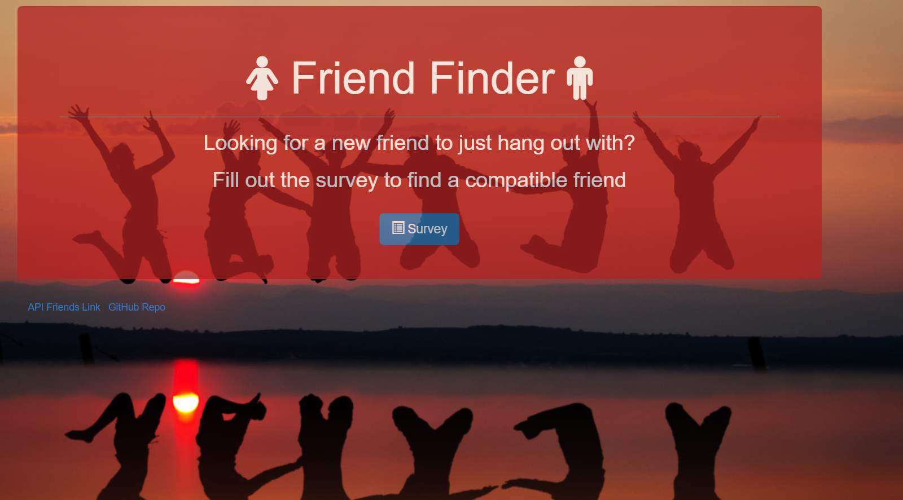

# Friend-Finder

Overview

In this activity, you'll build a compatibility-based "FriendFinder" application -- basically a dating app. This full-stack site will take in results from your users' surveys, then compare their answers with those from other users. The app will then display the name and picture of the user with the best overall match.

Image 1
<link rel="stylesheet" type="text/css" href="./images/home.PNG">
Image 2
<link rel="stylesheet" type="text/css" href="./images/survey.PNG">
image 3
<link rel="stylesheet" type="text/css" href="./images/match.PNG">

